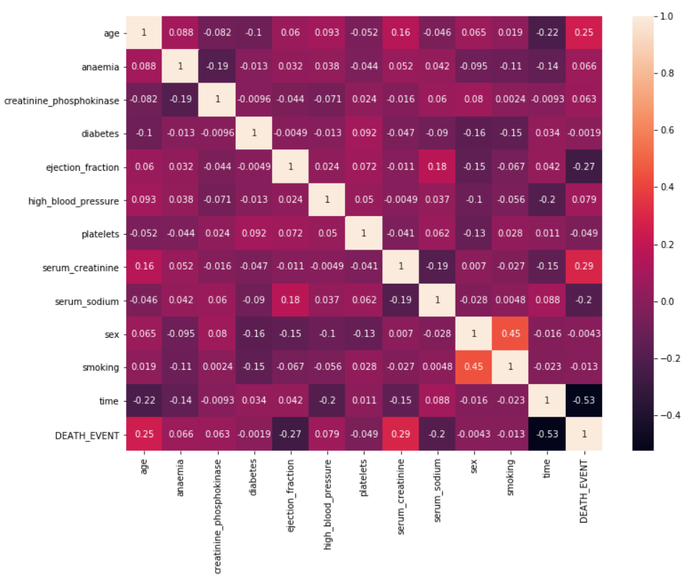
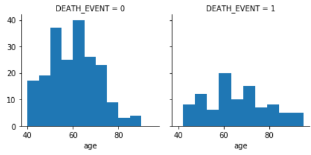
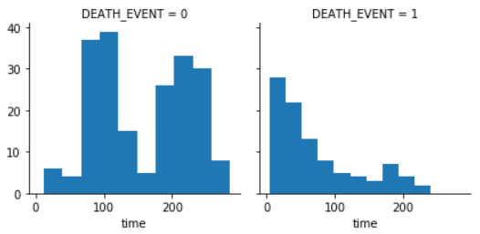
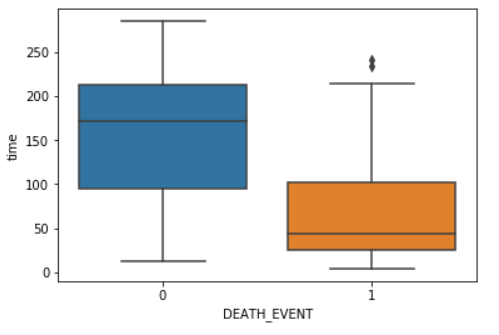
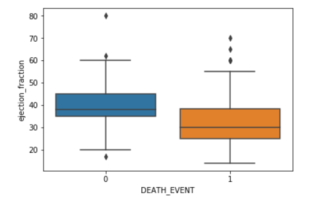
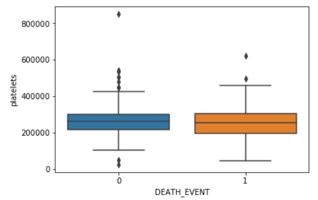
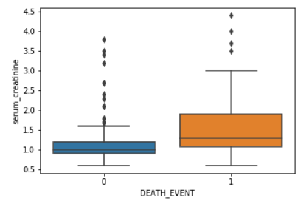
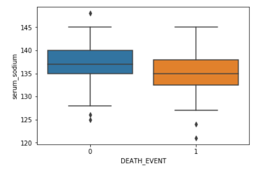

# Heart Failure Prediction

## Quick Intro

In this analysis, we are going to use Data Science Analysis to get insights on what makes people more likely to suffer from a heart failure.

## Problem statement

After doing an analysis of the features and their influence in the target variable, we want to know if we can create an algorithm that allows us to predict whether a person will suffer from a heart failure when we have some information about the patient, thus taking action and preventing it from happening. 

## Approach

Given the following clinical information about the patient:
- Age: Patient's Age (int)
- Anaemia: Decrease of red blood cells or hemoglobin (boolean)
- Creatinine_phosphokinase: Level of the CPK enzyme in the blood (mcg/L)
- Diabetes: If the patient has diabetes (boolean)
- Ejection_fraction: Percentage of blood leaving the heart at each contraction (percentage)
- High_blood_pressure: If the patient has hypertension (boolean)
- Platelets: Platelets in the blood (kiloplatelets/mL)
- Serum_creatinine: Level of serum creatinine in the blood (mg/dL)
- Serum_sodium: Level of serum sodium in the blood (mEq/L)
- Sex (binary)
- Smoking: If the patient smokes or not (boolean)
- Time: Follow-up period (days)
- DEATH_EVENT: If the patient deceased during the follow-up period (boolean)

We try to predict our target variable (if our patient will or will not suffer from a heart failure) with a classification algorithm. We will split our data into train and test, so that we can see if our model performs accordingly with new data that was not used to train it and validate if it can be used with new observations. 

The algorithms used to model and fit our data were: Naive Bayes, KNeighbors, Decision Tree and Random Forest. To quantify our models I used the metrics of model accuracy, confusion matrix, precision and recall, as we want to minimize the False Negatives (predicting the individual will not suffer from heart failure when they will) and maximize the TP (Predicting the individual will suffer from heart failure correctly).  

## Some Exploratory Data Analysis

### Correlation Matrix

### Target Variable Distribution by Age

### Target Variable Distribution by Time in Hospital

### Target Variable vs Features

## Result

The best performing algorithm was 

## Importance

The use of machine learning in the prediction of diseases can save countless lives, allowing people to detect illnesses they do not know they are suffering from and allowing the individuals to act before they are truly affected by it. 

### Contact Me

| Contact Method |  |
| --- | --- |
| Professional Email | gonzalobrunoldis@gmail.com |
| LinkedIn | https://www.linkedin.com/in/gonzalobrunoldi/ |
