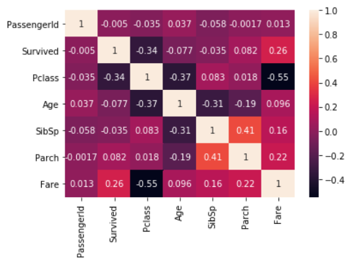
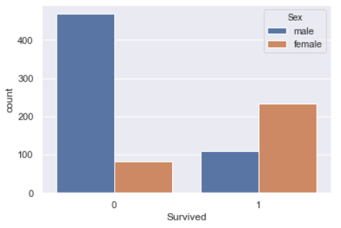
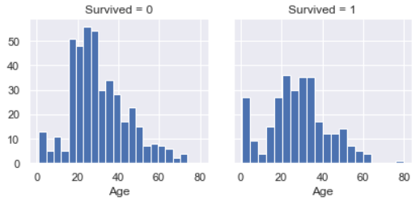
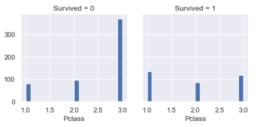
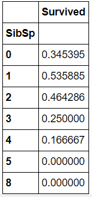
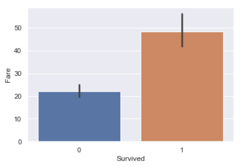

# Titanic Survivors Prediction

## Quick Intro

This was my first ML project. This is a very beginner-friendly project, and there are some astounding notebooks uploaded on Kaggle that are very clear and understandable. The aim was to grasp the structure of a Data Science projects, and familirize myself with coding and performing EDA, as well as predicting a target variable.

## Problem statement

In this analysis, we use data from the Titanic crash in 1912, and try to discover if some people had more chances to survive, and why. Towards the end of the project, we try to use a classification model to try and predict if a person survived with the information provided for every passenger. 
 
## Approach

Given the following information about the passengers:
- Survival:	0 = No, 1 = Yes (binary)
- Pclass: Ticket class	1 = 1st, 2 = 2nd, 3 = 3rd (int64)
- Sex	(male or female) (object)
- Age:	Age in years (float64)	
- SibSp: # of siblings / spouses aboard the Titanic	(int64)
- ParCh:	# of parents / children aboard the Titanic (int64)
- Ticket:	Ticket number (object)	
- Fare: Passenger fare (float64)
- Cabin: Cabin number	(object)
- Embarked:	Port of Embarkation	C = Cherbourg, Q = Queenstown, S = Southampton (object)

We try to predict our target variable (if the passenger will or will not survive the crash) with a classification algorithm. We will split our data into train and test, so that we can see if our model performs accordingly with new data that was not used to train it and validate if it can be used with new observations. 

The algorithms used to model and fit our data were: Naive Bayes, KNearerstNeighbors, Logistic Regression, Decision Tree and Random Forest. To quantify our models I used the metrics of model accuracy and confusion matrix as we want to know how well our model predicts the outcome using the known features.  

## Quick Exploratory Data Analysis Summary

### Correlation Matrix

### Target Variable vs Features 

## Result

The best performing algorithm was Logistic Regression with a Model Accuracy Score: 0.8212.

### Contact Me

| Contact Method |  |
| --- | --- |
| Professional Email | gonzalobrunoldis@gmail.com |
| LinkedIn | https://www.linkedin.com/in/gonzalobrunoldi/ |
